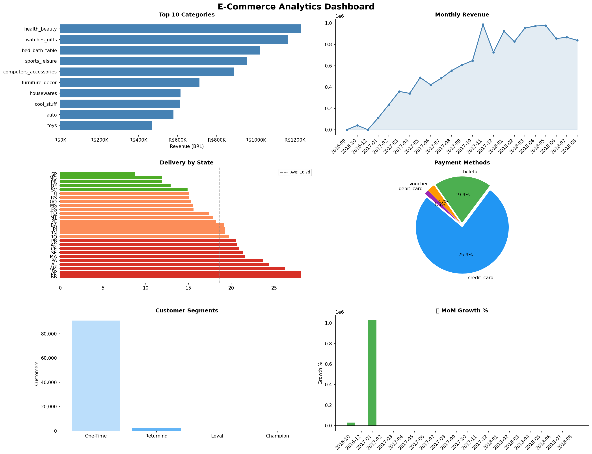

# 🛒 E-Commerce Analytics Pipeline

An end-to-end data engineering project built with Apache Spark (PySpark)
analyzing 500K+ rows of real Brazilian e-commerce data.

---

## 📊 Project Overview

This pipeline processes the Olist Brazilian E-Commerce dataset through
a complete data engineering workflow:

Raw CSV Data → Cleaning → Joining → Analytics → Dashboard

## 📈 KPIs & Analytics Built

- 🏆 Top 10 product categories by revenue
- 📅 Monthly revenue trend with MoM growth %
- 🚚 Delivery performance by state (late % + avg days)
- 💳 Payment method distribution
- 👥 Customer segmentation (Champion/Loyal/Returning/One-Time)
- 🏅 Top products per category using window functions
- 📊 Business summary cards (total revenue + total orders)

---

## 🔧 Tech Stack

| Tool        | Purpose                     |
|-------------|-----------------------------|
| PySpark 3.5 | Distributed data processing |
| Spark SQL   | Analytics & CTE queries     |
| Pandas      | Data conversion for charts  |
| Seaborn     | Statistical visualizations  |
| Matplotlib  | Charts & dashboard          |
| Parquet     | Optimized columnar storage  |

---

## 💡 Spark Concepts Used

- SparkSession & DataFrame API
- Manual schema definition
- Data cleaning (nulls, duplicates, corrupt rows)
- Transformations (filter, withColumn, when/otherwise)
- Aggregations (groupBy, agg, countDistinct)
- Window Functions (lag, rank, running total, MoM growth)
- Broadcast joins for performance optimization
- DataFrame caching & unpersist
- Partitioned Parquet storage
- Spark SQL with CTEs and subqueries

---

## 📂 Dataset

**Olist Brazilian E-Commerce** dataset from Kaggle:
👉 https://www.kaggle.com/datasets/olistbr/brazilian-ecommerce

| File                              | Rows    |
|-----------------------------------|---------|
| olist_orders_dataset.csv          | 99,441  |
| olist_order_items_dataset.csv     | 112,650 |
| olist_products_dataset.csv        | 32,951  |
| olist_customers_dataset.csv       | 99,441  |
| olist_order_payments_dataset.csv  | 103,886 |
| olist_order_reviews_dataset.csv   | 104,162 |
| olist_sellers_dataset.csv         | 3,095   |
| product_category_name_translation | 71      |

---

## 📊 Dashboard Preview

---

## 🧠 Key Business Insights Found

| Insight | Detail |
|---------|--------|
| 🏆 Top category | health_beauty with R$1.2M revenue |
| 📅 Best month | November 2017 (+52% MoM — Black Friday!) |
| 🚚 Fastest delivery | São Paulo at 8.7 days average |
| 🐢 Slowest delivery | Amapá & Roraima at 28 days average |
| 💳 Top payment | Credit card used by 75% of customers |
| 👥 Repeat buyers | Only 3% of customers buy more than once |
| 📈 Overall growth | Business grew 8x from Oct 2016 to 2018 |

---

